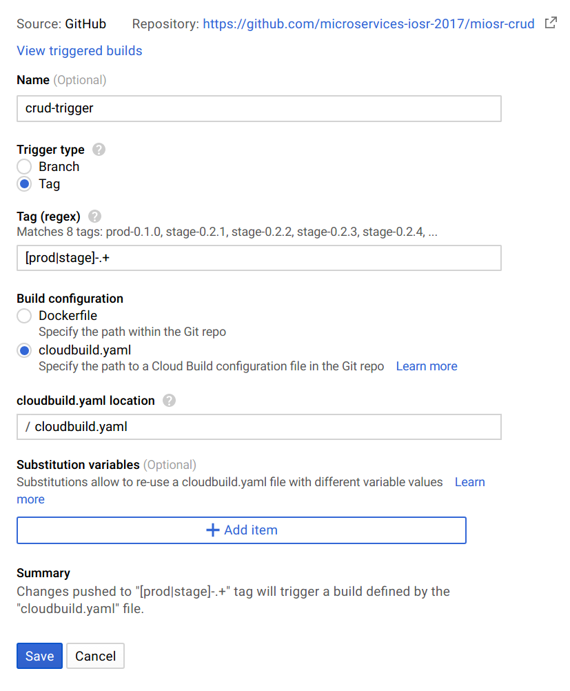

## GCP Setup

### Configure GC Image Repository
Goal: automatic building of docker images - but not for all commits, only for
ones specifically marked for building. GC Image Builder is going to watch our
GitHub repository for tags matching \[prod|stag\]-.+ regex.

\
Sidenotes:
* GC Image Builder doesn't watch GitHub repostiroy directly, but mirrors it first to
GC Source Repository, and then watches that repository
* This setup plays nicely with GitHub releases feature (if we use tags for that
purpose)

\
Steps:
1. Go to GC Image Repository and enable it.
1. Create new _Build trigger_

Done - creating new release should automatically cause GC Image Repository to initiate
build.

We have to repeat this process for each repository we want to have dockerized.

### Configure GitHub
Tag-based setup described previously doesn't really require any special organization
from GitHub. However, to keep things clean additional _release_ branch could be
introduced, and only stuff from this branch is released (at least using _prod_ tags).
This feature should come in especially handy when working with _stage_ releases,
which can be based on any commit on any branch.
When branch is merged to release, I would strongly recommend considering _squash-merge_
strategy.

Versioning convention:
* production release: X.X.0
* staging releases: X.X.Y - X.X is production release on which it's based, Y is
incremented every time new staging release is made